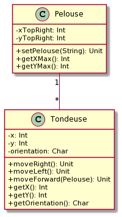

# MowItNow
Projet MowItNow

## Contexte :
Il consiste à déplacer des tondeuses placées sur un terrain délimité (1 carré avec des abcisses et des ordonnées, 
les max sont envoyées dans la 1ere ligne du fichier). Elles se déplacent grâce à des commandes envoyées dans un fichier.

## Choix techniques :
Le langague utilisé pour écrire ce programme est le langague scala

## Les classes principales :
Pour écrire ce projet, j'ai choisi de partir sur une simple configuration 
avec 2 classes(Tondeuse,Pelouse) et un objet Main, représenté par le diagramme UML suivant:

### La classe Pelouse :
la classe Pelouse permet tout simplement de définir la pelouse ayant ces attributs xTopRight et yTopRight

### La classe Tondeuse :
la classe Tondeuse permet tout simplement de définir les tondeuses et leurs mouvements en prenant en compte
les insctructions et la taille de la pelouse 

### L'objet Main :
C'est le coeur du programme, il permet de lire le fichier de le parser et d'envoyer les insctructions 
aux différentes tondeuses d'une façon séquentielle.

## Test :
Le fichier suivant est fourni en entrée :

5 5 \
1 2 N \
GAGAGAGAA \
3 3 E \
AADAADADDA 

On attend le résultat suivant (position finale des tondeuses) :

Tondeuse 1 : 1 3 N \
Tondeuse 2 : 5 1 E
